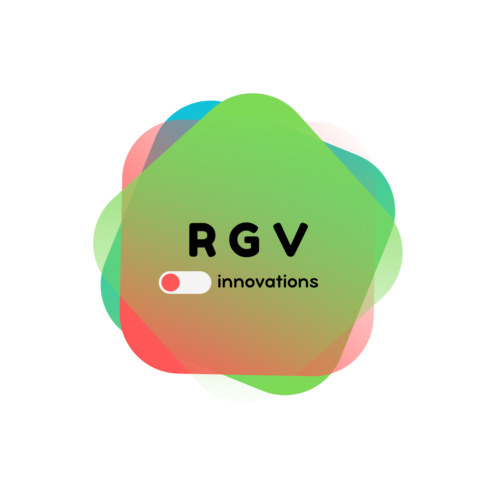

  

# 📚 RGV-UAMITOS-App

**Aplicación educativa desarrollada por RGV Innovations para la Secundaria UAMITOS**  
Proyecto final de la materia **Programación Visual Orientada a Eventos (PVOE)**  
Universidad Autónoma Metropolitana Unidad Azcapotzalco – 25-P

---

## 🧑‍💻 Desarrolladores

**RGV Innovations** está conformado por:

- **J. Alejandro Ramírez Martínez** –
- **Gustavo González Cortéz** –
- **Yarid Vallejo Ocejo** –

---

## 🏫 Cliente

**Secundaria UAMITOS**  
Inspirado en la secundaria asociada al proyecto educativo de la UAM.  
La aplicación busca brindar una solución interactiva orientada a las necesidades escolares del nivel secundaria.

---

## 🖥️ Tecnologías utilizadas

- Python 3.x
- PyQt5 / PySide6
- Qt Designer
- Estilos visuales con QSS (Qt Style Sheets)

---

## 📦 Estructura del repositorio

RGV-UAMITOS-App/
│
├── README.md
├── .gitignore
├── docs/
│ └── roles_equipo.md
├── src/
│ └── main.py
├── assets/
├── estilos/
│ └── estilos.qss
└── presentacion/

---

## 🧩 Funcionalidades esperadas

- Gestión de archivos (abrir y guardar)
- Manejo de excepciones con cuadros de diálogo
- Interfaz gráfica con barra de menú, barra de herramientas, botones con íconos e imágenes
- Créditos dentro del menú "Acerca de"

---

## 🎨 Diseño y presentación

El diseño visual será una parte fundamental del proyecto. Buscamos lograr una interfaz atractiva, funcional y clara, adaptada a un público escolar.

---

## 🐾 Nota curiosa

La secundaria cliente toma su nombre del personaje “**Uamito**”, la pantera mascota de la UAM Azcapotzalco. Este proyecto no solo es técnico, sino también afectivo: una colaboración entre niveles educativos de la misma comunidad universitaria.
